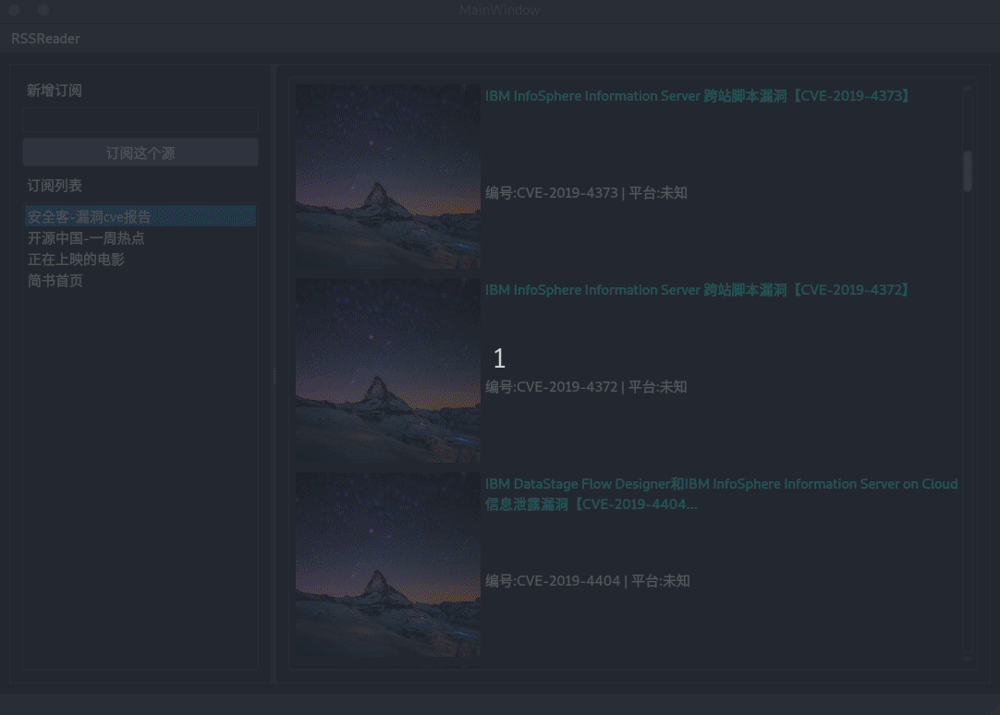

# RSSRaader

## 项目介绍

+ 本项目实现RSS订阅源的管理和阅读，实现了网络抓取RSS推送的功能

+ 项目详细报告见[doc/GroupReport](https://github.com/Nayaco/RSSReader/blob/master/doc/GroupReport.md)
+ 项目需求文档见[doc/ReuqestAnalisis](https://github.com/Nayaco/RSSReader/blob/master/doc/RequestAnalysis.md)

## 项目概况

+ 项目采用`C++17`标准开发，使用`Qt5`库，采用MVVM框架搭建
+ 支持跨平台编译，需`Qt5.13.0`及以上Qt版本以及`gcc-8.3.0`及以上GCC编译工具链
+ 采用TravisCI搭建持续集成环境 

## 功能实现

- [x] 添加RSS源，实现RSS订阅
- [x] 实现从RSS源抓取RSS文本
- [x] 实现富文本显示
- [x] 实现多RSS源切换
- [x] 实现sidebar管理源
- [x] 实现卡片效果

## 单元测试

### 测试方式

由于需要较多的网络资源，采用手动测试。编写测试文件，并在本地计算机上运行测试程序。

### 测试截图


### 运行截图

+ 添加订阅源


+ 订阅源摘要


+ 文章详情页面


## 项目目录
```
.
├── app
│   ├── articles
│   │   ├── articles.cpp
│   │   ├── articles.h
│   │   └── articletype.h
│   ├── details
│   │   ├── detail_dialog.cpp
│   │   └── detail_dialog.h
│   ├── loading
│   │   ├── loading.cpp
│   │   ├── loading.h
│   │   ├── loading_page.cpp
│   │   └── loading_page.h
│   ├── main.cpp
│   ├── main.h
│   ├── mainwindow.cpp
│   ├── mainwindow.h
│   └── qdarkstyle
│       ├── style.qrc
│       └── style.qss
├── bin
├── common
│   ├── common.h
│   ├── commonstream.h
│   ├── middleware.h
│   └── property.h
├── doc
│   ├── GroupReport.md
│   ├── img
│   │   ├── add.gif
│   │   ├── model1.png
│   │   ├── read1.gif
│   │   ├── read2.gif
│   │   ├── view1.png
│   │   ├── view2.png
│   │   ├── view3.png
│   │   ├── viewdis2.png
│   │   ├── viewdis3.png
│   │   └── viewdis.png
│   ├── personal-report-HuangShan.md
│   ├── personal-report-ZhangWenjie.md
│   ├── personal-report-ZhengZehui.md
│   └── RequestAnalysis.md
├── externalLib
│   ├── tinyxml2.cpp
│   ├── tinyxml2.h
│   └── tinyxml2.o
├── images
│   ├── default_img.jpeg
│   └── images.qrc
├── Makefile
├── middlelayer
│   ├── viewmodel.cpp
│   └── viewmodel.h
├── model
│   ├── crequest
│   │   ├── crequest.cpp
│   │   └── crequest.h
│   ├── irequest
│   │   ├── irequest.cpp
│   │   └── irequest.h
│   ├── model.cpp
│   ├── model.h
│   └── sink
│       ├── modelsink.cpp
│       └── modelsink.h
├── parser
│   ├── channel.cpp
│   ├── channel.h
│   ├── item.cpp
│   ├── item.h
│   ├── RSSparser.cpp
│   └── RSSparser.h
├── README.md
├── request
│   ├── request.cpp
│   └── request.h
├── RSSReader.pro
├── testMid.pro
├── testModel.pro
├── testParser.pro
├── testReg.pro
├── tests
│   ├── Makefile
│   ├── parseTest.cpp
│   ├── testMiddleware.cpp
│   ├── testMiddleware.h
│   ├── testModel.cpp
│   ├── testModel.h
│   └── testReg.cpp
├── uidesign
│   ├── detail_dialog.ui
│   ├── loading_page.ui
│   └── mainwindow.ui
└── view
    ├── ctimer
    │   ├── ctimer.cpp
    │   └── ctimer.h
    ├── mainwindow
    │   ├── mainwindowsink.cpp
    │   └── mainwindowsink.h
    └── sink
        └── viewsink.h

24 directories, 79 files
```

## 开发成员

+ 组长
    + [张文捷](https://github.com/Nayaco)
        + 分工协调，整体MVVM框架搭建、TravisCI持续集成环境配置
        + 负责Model层及网络请求RSS和RSS解析的实现
        + Model层数据持续化实现
        + App层组装、单元测试代码编写、二进制文件发布
+ 组员
    + [黄山](https://github.com/dydxh)
      + 应用程序 UI 设计、美化与实现
      + 负责 View 层设计与实现
      + View 层与 ViewModel 层对接

    + [郑泽晖](https://github.com/zhengzh23333)
        + viewmodel基本功能实现