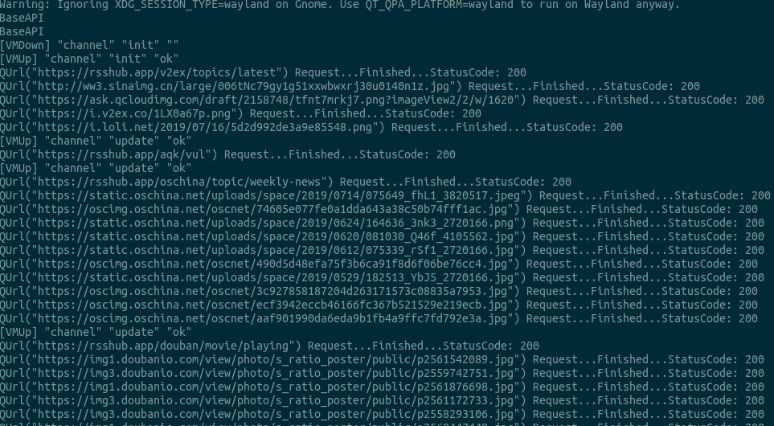
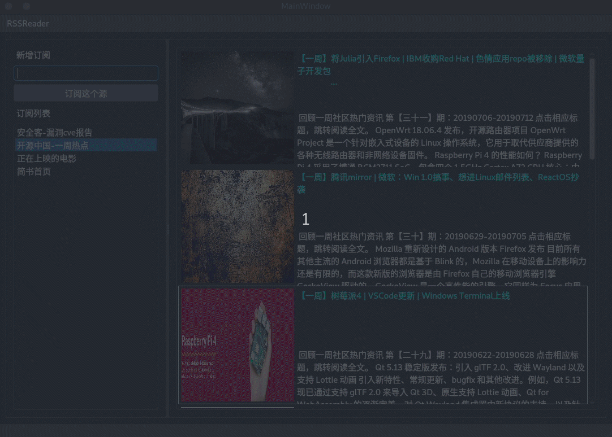
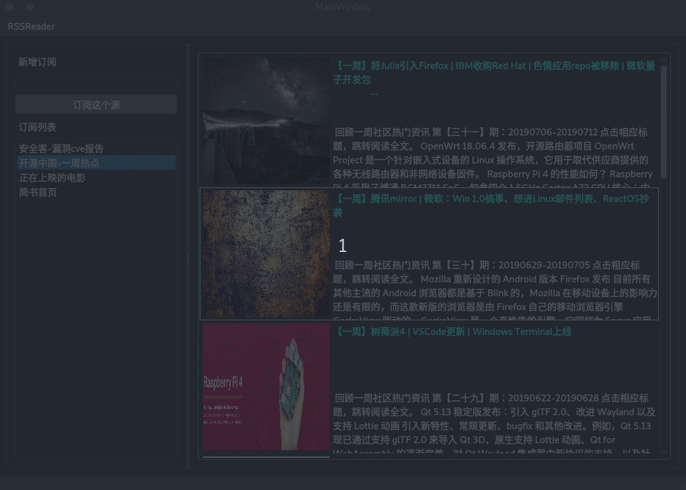

# RSSReader 小组报告

## 问题及背景

+ RSS订阅曾经在网络上及其流行，因此曾经也有不少RSS阅读器，由于现代智能手机的发展，应用推送机制逐渐成为用户接收网站信息更新的通道，但是在PC端RSS订阅依然有需求，并且大部分技术博客依然采用这种方式推送消息，对于工程师来说一个RSS reader非常实用。我们决定实现一个RSS reader，并命名为`RSSReader`

+ 项目中的CI/CD采用TravisCI的解决方案，整体采用MVVM框架

## 开发计划和分工

### 开发计划

+ 1. 根据初步需求分析搭建整体的框架和以及定义接口约定，利用TravisCI搭建持续集成环境

+ 2. 三层同步开发实现基本的数据传递、命令传递以及基本的UI框架

+ 3. 实现Model层的RSS数据解析功能

+ 4. 实现ViewModel层添加、删除、更新订阅源的业务逻辑，Model层实现相应数据处理

+ 5. Model层实现网络请求功能

+ 6. 优化UI，实现轮询更新数据

### 小组分工

+ 组长
    + [张文捷](https://github.com/Nayaco)
        + 分工协调，整体MVVM框架搭建、TravisCI持续集成环境配置
        + 负责Model层及网络请求RSS和RSS解析的实现
        + Model层数据持续化实现
        + App层组装、单元测试代码编写、二进制文件发布
+ 组员
    + [黄山](https://github.com/dydxh)

    + [郑泽晖](https://github.com/zhengzh23333)
        + viewmodel基本功能实现

## 每轮迭代效果说明

### 第一轮迭代

+ [x] 设计主界面的大致内容
+ [x] TravisCI环境搭建

### 第二轮迭代

+ [x] 为左侧界面增加了输入框与提交按钮
+ [x] 实现三层结构的完整运行

### 第一轮迭代

+ [x] 设计实现了文章详情页面的内容
+ [x] 实现网络请求功能和RSS文本解析功能
    + [x] 网络下载RSS文本
    + [x] 解析RSS文本内容（不包含`!CDATA[html]`格式内容解析）
    + [x] 添加源
    + [x] 删除源
    + [x] 更新源

### 第一轮迭代

+ [x] 设计实现了 loading 页面
+ [x] 实现数据持久化
    + [x] 退出保存
    + [x] 初始加载

### 第一轮迭代

+ [x] 优化UI界面
+ [x] 实现图片加载功能，如文本中的``可解析加载并显示

## 单元测试

### 测试方式

由于需要较多的网络资源，采用手动测试。

编写测试文件，并在本地计算机上运行测试程序。

### 测试截图



### 最终运行效果图

+ 添加订阅源


+ 订阅源摘要


+ 文章详情页面


## 项目目录
```
```


