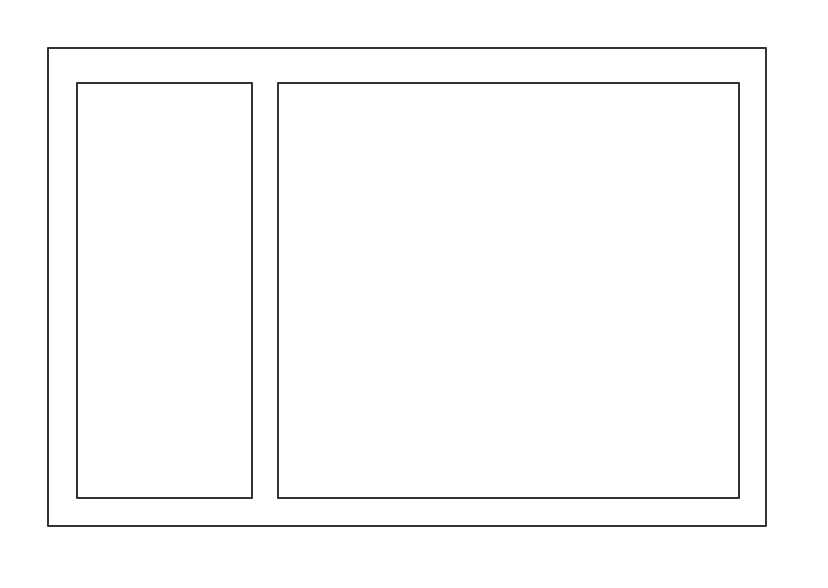
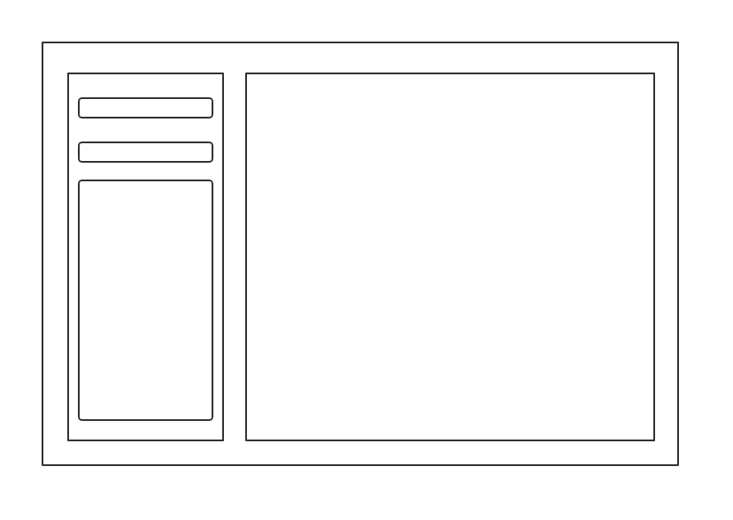
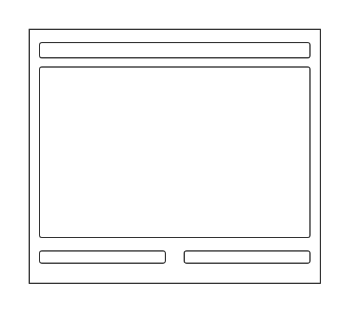
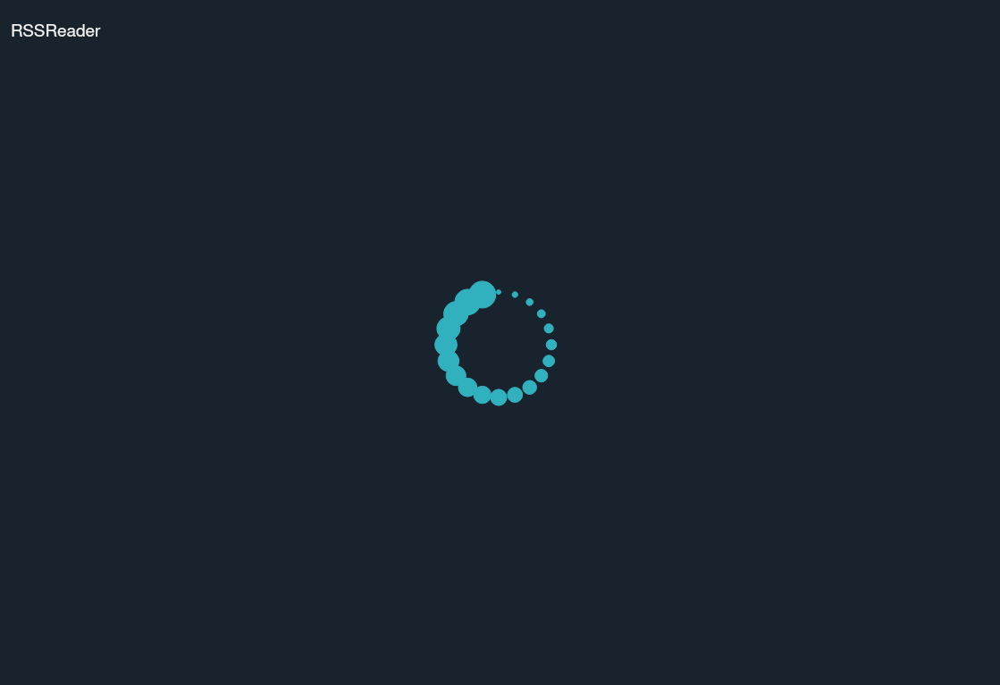
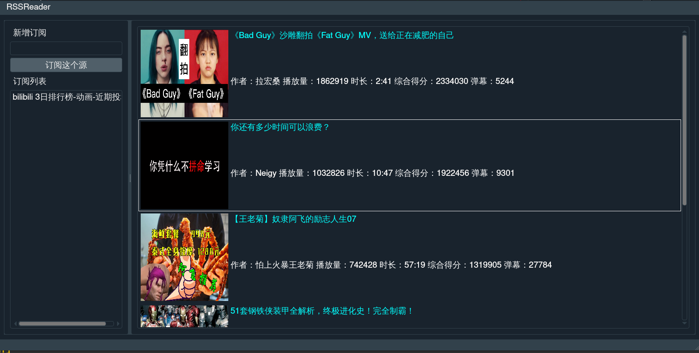
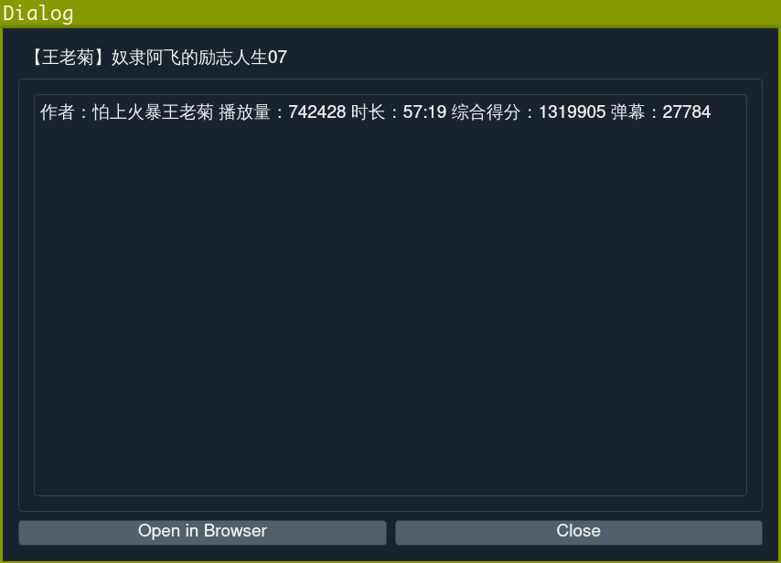

## View 设计报告

### 设计思路

本次实现的 RSSReader 中，我们一共拥有三个界面，它们分别是：

- 主界面
  
  主要分为两个部分，左侧显示已经订阅的 rss 服务并提供新增订阅的服务

  右侧提供文章缩略显示的功能，显示文章的封面、标题、概述等信息。

- 文章详情界面
  
  主要显示文章的正文内容，上方显示文章的标题，中间文本框显示文章的正文，下方提供关闭窗口以及在系统默认浏览器中打开对应的网页等操作。

- loading 界面
  
  由于从订阅源获取新的内容涉及到网络通讯，而网络的传输速度是不可控的，因此为了让用户知道我们的文章何时加载成功，我们在数据从网络获取完毕前为用户展示 loading 界面以提升用户体验。

### 实现方案

本次前端 view 层面的实现主要基于 Qt5，作为一款跨平台的强大工具，Qt5 为我们的工程开发提供了极大的便利，能够高效的开发出优雅而符合需求的界面。而 Qt Designer 这一强大的特性，使得界面的外观开发变得方便快捷。

而本次我们三个界面的实现细节如下：

- 主界面

  主界面继承与 QMainWindow 实现了整个 MainWindow 的显示。

  其中左右两侧窗口通过水平方向的 splitter 连接，实现了二者宽度的调整。

  左侧上方为一个输入框与提交按钮，下方为一个 ListView 显示了诸多已经订阅的 rss 名称。

  右侧也是一个 ListView，此处承载的信息内容的绘制通过手动实现类型的绘制函数 (paint) 做到了自定义布局。

- 文章详情
  
  文章详情页比较简单，整个界面作为一个 QDialog 实现，主要为左上角的标题显示 (QLabel) 与中间的文本显示 (TextBroswer)，下方两个 QPushButton 提供必要的点击服务。

- loading 界面
  
  该界面主题部分为一个 QWidget，居中显示了类似于 windows 10 的加载动画，主要实现为显示若干个圆形绕整个界面中心的转动，效果较为优美。

### 版本迭代

#### 第一次版本迭代

设计了主界面的大致内容，分为左右两侧展示界面。

#### 第二次版本迭代

为左侧界面增加了输入框与提交按钮，使得用户可以通过此处新增 rss 订阅源。

#### 第三次版本迭代

设计实现了文章详情页面的内容

#### 第四次版本迭代

设计实现了 loading 页面

#### 第六次版本迭代

为所有界面增加了好看的 QSS 格式文件，使得界面的外观得到了美化。

##### 最终主界面

##### 最终文章详情界面

### 心得体会

- 通过本次课程学习到了 MVVM 的编程思想与模式，了解到了软件架构的重要性。
- 通过课程学习了解了产品开发的知识，学会了与队友高效合作，进行需求分析。
- 通过实现 view 层的内容，对 Qt 有了深入的了解，能够高效的使用 Qt 自带的库内容，并使用 Qt designer 对界面进行设计。
- 通过使用 Travis-CI 这一持续集成工具，对软件开发中的测试环境有了深刻的认识。

### 课程改进意见

- 希望能够广泛的讲解 MVC、MVP、MVVM 三种框架的的代表性框架产品，使同学们对现代产品开发工具有宏观的认识。
- 希望能够增加一些工程中用到的 C++ 的基本知识与技巧，开发产品的同时也能促进对 C++ 这一复杂语言的认识。
