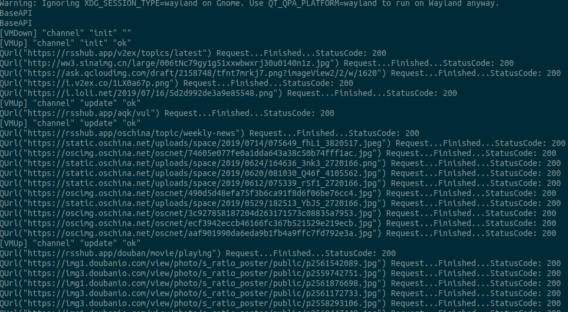

# 个人报告-张文捷

## 1. 个人分工


在这个项目中我担任组长，主要负责的部分是model层和viewmodel层的搭建以及网络轮询的实现。

+ 分工协调，MVVM框架的搭建，以及利用Travis搭建持续集成环境

+ 利用QT的网络库实现了底层的网络请求层，并在该层上利用tinyxml库实现初步的xml解析，最后将数据细化处理，实现文本的规格化

+ model层实现对数据的集中管理，通过对外暴露接口实现Key-Value式的访问，并接收控制信号实现对应的数据操作

+ viewmodel层实现对应的业务逻辑，有初始化、添加、轮询更新等任务，接收来自model和view层的控制信号，并处理或转发

## 2.实现方案

### MVVM框架搭建

+ 设计思路 

本项目采用了QT的消息和槽机制进行消息传递，以达到层与层之间的解耦，对于整个项目，在初期即定义每一层均为一个中间件（Middleware），层与层之间的消息传递信号以及槽函数由基类定义，每一层均继承中间件的接口。

+ 整体结构

    + Middleware
    
    实现基本的结构，是每一个层的抽象。

    + View层

    用户交互界面以及UI显示，与Vewmodel交互，传递命令，接收命令执行完毕以及数据更新的信号。

    + ViewModel层

    转发数据更新信号，处理View层传递的命令，处理业务逻辑，将业务逻辑的数据操作命令传递至Model层。

    + Model层

    RSS数据源数据请求，调用RSSParser对RSS数据进行处理。

    + RSSParser
    
    解析RSS数据，将数据转换成Property对象。

    + App层

    创建并绑定View、ViewModel和Model层，整合各层生成可执行的应用。

### TravisCI持续集成环境搭建

本项目采用TravisCI搭建持续集成环境，配置如下：

``` yml
language: cpp
dist: bionic
compiler: gcc

before_install:
  - sudo add-apt-repository -y ppa:ubuntu-toolchain-r/test
  - sudo apt-get update -qq
  - sudo apt-get install -qq qt5-default qttools5-dev
  - sudo apt-get install -qq g++-8
  - sudo update-alternatives --install /usr/bin/g++ g++ /usr/bin/g++-8 90

script: 
  - qmake RSSReader.pro
  - make --silent
```

### 单元测试

由于项目中需要良好网络状况并且实际测试时间较长（网络请求时间较长），单元测试采用手动测试的方式。
测试包括：

  + 数据添加

  + 数据更新
  
  + 数据删除
  
  + 数据初始化
  
  + 数据持久化

单元测试的部分截图如下：



### RSS Parser

RSS Parser部分主要负责RSS内容的请求以及XML的解析，并且提取RSS信息中的图片，并对图片发出HTTP请求获取远程图片。

+ 设计思路

RSS数据源取得的数据是一个XML文本数据，对于前端来说无法直接使用。因此在后端获取数据时需要将XML文本数据按照RSS格式解析成前端可访问的文本和图片等信息。

+ 模块结构
    
    + RSSParser类
    
    RSSParser类中实现了XML按照RSS格式解析的方法，采用tinyxml库作为底层的xml解析方式。

    + Channel数据类
    
    Channel数据是Parser解析得到的数据，包含若干Item数据。

    + Item数据类

    Item数据是订阅源提供的订阅信息。

### Model

model层主要负责数据处理以及数据的存储。

+ 设计思路

Model层主要处理数据，对数据进行管理和监视，当数据发生变化时发出信号提醒ViewModel层，并接收来自ViewModel层的数据操作命令。

+ 模块结构

    + Model类

    Model类处理数据以及发出网络请求获取RSS数据以及图片数据。

### ViewModel

ViewModel层主要对View层的业务逻辑命令进行处理，并且通过信号传递的方式调用Model层操作具体数据，并转发来自Model层的数据更新信号。

+ 设计思路

本项目中ViewModel主要负责业务逻辑的处理，对外并且严格按照Middleware中定义的信号传递消息。

+ 模块结构
    + 业务逻辑命令信号SIG_TRI

    SIG_TRI是一个接收三个字符串参数的信号，对于字符串参数进行解析，如：`SIG_TRI("channel","add","https://rsshub.app/leetcode/articles")`命令执行订阅Leetcode的业务逻辑。

    + 接收器UpstreamReciever和DownStreamReciever
    
    接收器为槽函数，接收来自View层和Model层的信号。

### App层组装

+ 实现View和ViewModel以及ViewModel和Model之间的绑定

+ ViewModel和Model之间数据通过`Get`函数进行传递

+ 将View层和所需ViewModel绑定，View中的接收器和ViewModel的SIG_TRI自动绑定。

## 3.个人心得

+ 本次的短学期课程中深入学习了MVVM框架，以及持续集成，MVVM模式和CI对生产效率的提升对我留下了非常深刻的印象

+ 过去也曾经使用过MVVM框架进行一些前端工程开发，由于前端工程框架较为工程化没有机会对整个框架一些更为底层的内容深入探究，在这门课堂探究到MVVM更底层的内容，这是一大收获

+ 单元测试和开发同时推进，使Debug过程能精确定位到具体的几处地方，减小了后期Debug的压力

+ CI/CD的自动化节省了团队大量时间在编译和部署上。通过CI/CD，编译过程无需连接服务器手动执行大量指令和配置环境，特别当工程较大的时候，编译时间较长，如果每次需要手动执行编译命令是不可想象的，而CI/CD解决了这一问题

## 4.课程建议

- 课程中较为难理解的是MVVM框架，如果课程中能引入一些使用MVVM框架的库或产品以及使用MVC和MVP框架的库或产品，对比他们的结构讲解，会更容易理解MVVM框架，实践中也会减少一些对MVVM框架的疑惑

- 课程中如果讲解一下C/C++的一些较为经典的代码约定对于团队协作会比较有帮助，由于这门课程介绍工程和协作，代码约定我认为还是比较重要的